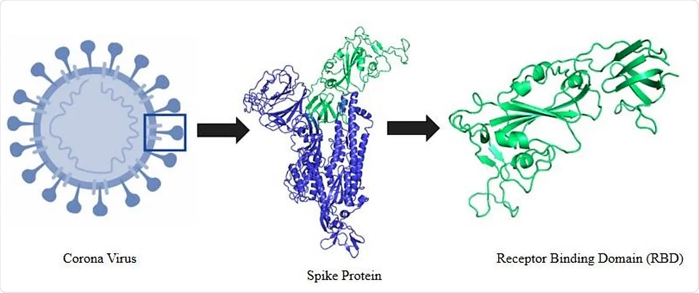
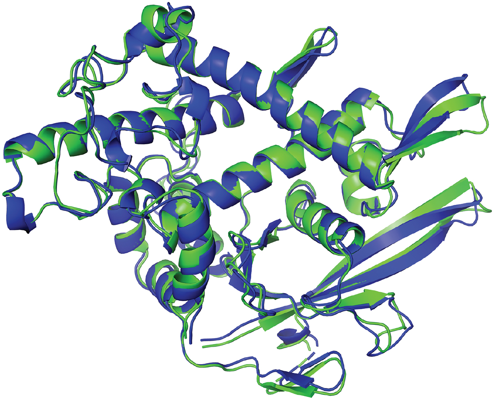

[Background image source](https://www.independent.co.uk/travel/europe/slovenia/nova-gorica-slovenia-italy-capital-of-culture-b2712344.html)

# *De Novo* Nanobody Design

> 🌐 **Interactive website:** [biochorl.github.io/Nanobody_de_novo_design](https://biochorl.github.io/Nanobody_de_novo_design/) — the same workflow with a guided, mobile-friendly flow and one-click "Open in Colab" buttons.

This material was built for teaching and demonstration on free Google Colab GPUs — adequate to learn the concepts of *de novo* nanobody (re)design, **not** to scale a production-level *in silico* screening. It assumes little knowledge of protein design tools and limited structural biology background.

A brief introduction on AI-assisted protein design is available at this [link](./Misc/De-novo_design_intro.pdf).

## Overview

Starting from just two PDB structures — a **target antigen** and a **nanobody scaffold** — the workflow produces a full-atom *de novo* nanobody–antigen complex with an orthogonal confidence check, in **five steps** (four Google Colab notebooks):

| Step | Stage | Tool |
|---|---|---|
| 1 | **Target & nanobody scaffold** (inputs) | two PDB structures |
| 2 | **Epitope prediction & CDR identification** | DiscoTope-3.0 + Nanocdr-X |
| 3 | **De novo CDR design & side-chain refinement** | IgGM + PIPPack |
| 4 | **CDR sequence optimization** (in complex context) | AntiFold |
| 5 | **Blind validation by refolding** | ESMFold2 (BioHub) |

A one-time, free **BioHub API token** is needed before step 5 (see below). This 5-step pipeline replaces the previous 6-step one (RFantibody → ProteinMPNN → PIPPack → AntiFold → gapTrick); the old notebooks are kept in [`backup_old_pipeline/`](./backup_old_pipeline).

> 📱 **On a phone / no laptop?** Every notebook has a **"Mobile mode"** switch at the top: turn it on and the required input files are downloaded automatically from this repository, so you can run the whole workflow from Google Colab without ever touching a local file system.

**Note on File Access:** the links to files below (like [7z1b.pdb](./Intermediate_inputs/7z1b.pdb)) are relative paths. Clicking them on GitHub shows the file; to download it, use the **"Download raw file"**  button on the file viewer page.

---
### 1. Target & nanobody scaffold (inputs)

<table>
  <tr>
    <td align="center">
      
       
      <em>The RBD is the part of the spike that grabs the human ACE2 receptor — an ideal target for nanobody binders (concept after <a href="https://www.news-medical.net/news/20200608/The-receptor-binding-domain-of-the-SARS-CoV-2.aspx">news-medical.net</a>)</em>
    </td>
  </tr>
</table>

You only need two structures to start:

*   **Target antigen** — any protein structure (PDB) you want the nanobody to bind. The example is the SARS-CoV-2 spike RBD: [7z1b.pdb](./Intermediate_inputs/7z1b.pdb)
*   **Nanobody scaffold** — a pre-selected VHH framework whose CDR loops will be redesigned: [nanobody_scaffold.pdb](./Intermediate_inputs/nanobody_scaffold.pdb)

---
### 2. Epitope prediction & nanobody CDR identification

<table>
  <tr>
    <td align="center">
      
       
      <em>Predicting epitope hotspots on the target antigen</em>
    </td>
    <td align="center">
      
       
      <em>Identifying the nanobody complementarity-determining regions (CDRs)</em>
    </td>
  </tr>
</table>

*   **Tools:** [DiscoTope-3.0](https://services.healthtech.dtu.dk/services/DiscoTope-3.0/) and [Nanocdr-X](https://github.com/lescailab/nanocdr-x)
*   **Purpose:** Prepare everything IgGM needs: predict epitope hotspots on the antigen and mask the nanobody CDRs to redesign. It clusters the predicted epitope into patches (output as **0-based positional indices** for IgGM) and builds the `IgGM_input.fasta` (CDRs marked as `X`) and the single-chain `antigen_A.pdb`.
*   **Colab Notebook:** 
*   **Example output:**
    *   **Epitope/CDR annotations:** [Step_1_annotations.txt](./Intermediate_inputs/Step_1_annotations.txt)
    *   **IgGM input FASTA:** [IgGM_input.fasta](./Intermediate_inputs/IgGM_input.fasta)
    *   **Single-chain antigen PDB:** [antigen_A.pdb](./Intermediate_inputs/antigen_A.pdb)
---
### 3. *De novo* CDR design & side-chain refinement (IgGM + PIPPack)

<table>
  <tr>
    <td align="center">
      
       
      <em>Generative co-design of sequence and structure</em>
    </td>
    <td align="center">
      
       
      <em>Side-chain repacking (PIPPack)</em>
    </td>
  </tr>
</table>

*   **Tools:** [IgGM](https://www.biorxiv.org/content/10.1101/2024.09.19.613838v2) and [PIPPack](https://onlinelibrary.wiley.com/doi/10.1002/prot.26705)
*   **Purpose:** IgGM co-designs the sequence and structure of the CDRs against the antigen, then PIPPack repacks the side chains in the antigen context and makes the full-atom model. This single notebook replaces the old **RFantibody + ProteinMPNN + PIPPack** sequence. You can optionally **sample a range of CDR3 lengths** (one length per design), and the notebook exports a `cdrs_annotation.json` carrying the exact CDR mask of every design for the next step.
*   **Colab Notebook:** 
*   **Example output:** the refined full-atom complex(es) + the CDR mask.
    *   **Refined designs (PIPPack) + CDR annotation:** [Refined_designs.zip](./Intermediate_inputs/Refined_designs.zip)
---
### 4. CDR sequence optimization in complex context (AntiFold)

<table>
  <tr>
    <td align="center">
      
       
      <em>CDR sequence optimization with a CDR-specialized inverse-folding model</em>
    </td>
  </tr>
</table>

[image source](https://doi.org/10.1093/bioadv/vbae202)

*   **Tool:** [AntiFold](https://academic.oup.com/bioinformaticsadvances/article/5/1/vbae202/8090019)
*   **Purpose:** Re-design the CDR sequences with a CDR-specialized inverse-folding model, with the antigen frozen as structural context.
*   **Colab Notebook:** 
*   **Example output:** the top redesigned sequences packaged with the complex PDBs.
    *   **AntiFold best designs:** [AntiFold_Best_Designs.zip](./Intermediate_inputs/AntiFold_Best_Designs.zip)
---
### 🔑 Before step 5 — get a free BioHub API token

Step 5 folds your designs with **ESMFold2** through the BioHub API, which needs a free token (done once):

1.  Open [biohub.ai](https://biohub.ai/) and sign in (free account).
2.  Go to **Developer Console → API keys**: [biohub.ai/developer-console/api-keys](https://biohub.ai/developer-console/api-keys).
3.  Click **Create API key**, copy it, and paste it into the `biohub_token` field of the step-5 notebook.

⚠️ Keep the token private — don't share a notebook with the token filled in.

---
### 5. Blind validation by refolding (ESMFold2)

<table>
  <tr>
    <td align="center">
      
       
      <em>🟢 Design nanobody &nbsp;·&nbsp; 🔵 Refolded (ESMFold) nanobody, after antigen alignment</em>
    </td>
  </tr>
</table>

*   **Tool:** [ESMFold2](https://www.biohub.ai/models/esmfold2) via the BioHub API
*   **Purpose:** Refold the designed nanobodies in complex with the target (no template), align them with the structure of the designs, and report basic confidence metrics. The ESMFold model is rigidly **superposed on the antigen**, then the **RMSD is measured on the nanobody** (lower = closer to the design); the notebook also reports **pLDDT, pTM and ipTM** (ipTM being the key interface metric).
*   **Colab Notebook:** 
*   **Output:** produced **live when you run the notebook** with the automatic inputs — the blindly refolded complex, its confidence metrics, and the antigen-aligned comparison models.

---
## Screening and Further Validation of *de novo* designed nanobody binders

Further steps of validation are crucial for increasing the likelihood of success in experimental settings, both *in vitro* and *in vivo*.
For a real campaign you would generate at least **>10,000** *in silico* designs (full-atom structures) and filter them hard — expect **>98%** of them to fail *in silico*! This is the reason why such methods require dedicated hardware more than deep knowledge of deep-learning methods. Moreover, the most limiting step is finding methods for improving the success rate after experimental validation. This is usually done by combining several orthogonal lines of evidence, despite the fact that no single or combined approach has been demonstrated to systematically improve the success rate on any application (the list below is not comprehensive, just some examples):

*   **Interaction confidence from deep learning approaches**
    *   Re-predict the complex with AF2 / AF-Multimer / AF3 *without* templates and check consistency with the design, plus flexibility-sensitive scores (e.g. [Local Interaction Score](https://github.com/flyark/AFM-LIS) or [ipSAE](https://doi.org/10.1101/2025.02.10.637595))
*   **Empirical-physics scores:**
    *   Protein-protein docking scores (e.g., HADDOCK, Rosetta-ddG, Fold-X)
    *   Interface geometry (e.g., Rosetta interface analysis, dG/dSASA, packstat, buried unsatisfied H-bonds)
*   **Physics-based assessment:**
    *   Molecular Dynamics simulations (> 100 ns) for complex stability (GROMACS, AMBER, …)
    *   Enhanced sampling for the binding free-energy landscape (e.g., metadynamics with PLUMED)
*   **Developability assessment** (compared with the parent scaffold if its developability is known):
    *   Solubility, stability and aggregation propensity prediction
    *   Off-target / polyreactivity risk

> 🚀 **A note on accessibility.** Generative protein design is becoming far more accessible, through ready-made web interfaces that hide all the preparation steps, in-silico validation and infrastructure shown in these notebooks. A good example is **BoltzGen**, usable directly through the **[BoltzLab platform](https://lab.boltz.bio/login)** — showing how easy it is now to design a binder straight from a browser.

---
## Acknowledgements

Most of the Google colaboratories were developed by customizing other colabs, referenced in the corresponding file; the paper or original source of each method is linked above.

## Contact

For any questions, suggestions, or issues, please open an issue in this GitHub repository or contact me at [marco.orlando1991@live.it](mailto:marco.orlando1991@live.it) or [marco.orlando@ung.si](mailto:marco.orlando@ung.si).
